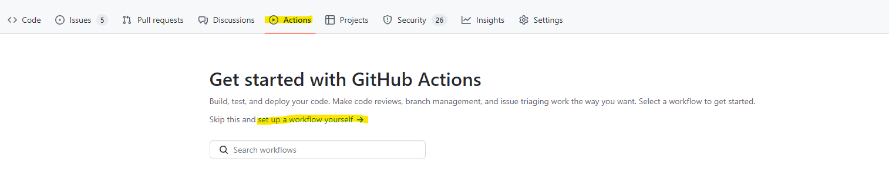
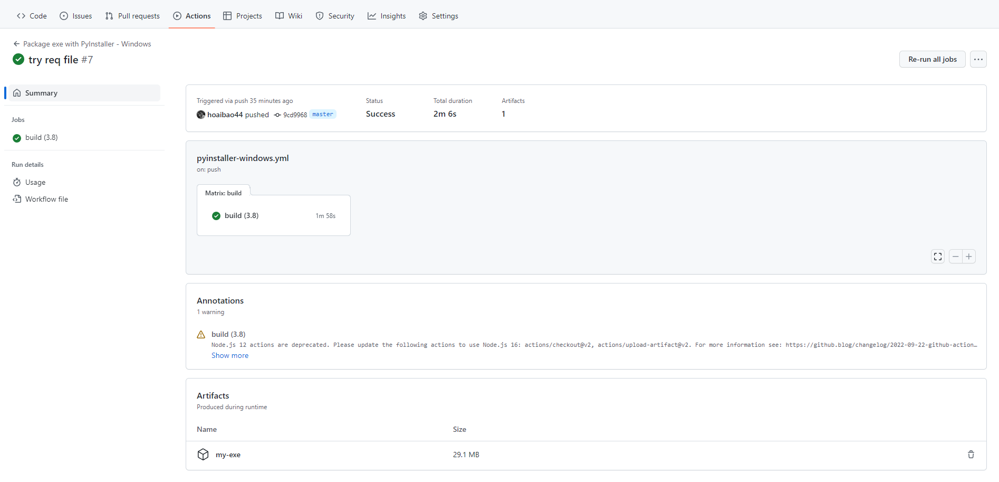

# python-cicd-example
This repo is just a step-by-step set up of the repo below.
https://github.com/JackMcKew/pyinstaller-action-windows-example

## HOW TO SET UP

### Step 0: In case you are new to github action


Then copy the code below:

```
name: Package exe with PyInstaller - Windows

# set up trigger here: on push or PR to branch `master`
on:
  push:
    branches: [ master ]
  pull_request:
    branches: [ master ]

jobs:
  build:

    runs-on: ubuntu-latest
    strategy:
      matrix:
        python-version: ["3.7"] # >3.7 can not use this action

    steps:
      - uses: actions/checkout@v3
      - uses: actions/setup-python@v4
        with:
          python-version: ${{ matrix.python-version }}
      - uses: actions/checkout@v2
      - name: PyInstaller Windows
        uses: JackMcKew/pyinstaller-action-windows@v0.1.2
        with:
          path: src          # where the main file is
          spec: build.spec   # must run pyinstaller locally one to get this build.spec file
                             # add `!build.spec` to .gitignore 

      - uses: actions/upload-artifact@v2
        with:
          name: my-exe           # output file name
          path: src/dist/windows # or path/to/artifact
```

### STEP 2: Add dependency
We have 
```
reqs-dev.txt
reqs-prod.txt
requirements.txt
```
`dev` file is for dev env, you might need something like jupyter... but it will not be included in `prod` file.

The `requirements.txt` just a poiter.

> You might get a lot of dependency conflict when trigger action, so prepare for that 

### STEP 3: Trigger build, get output file
In this set up, the action trigger whenever new code go to `master`
You will eventually end up with somthing like this.


## Happy CI/CD